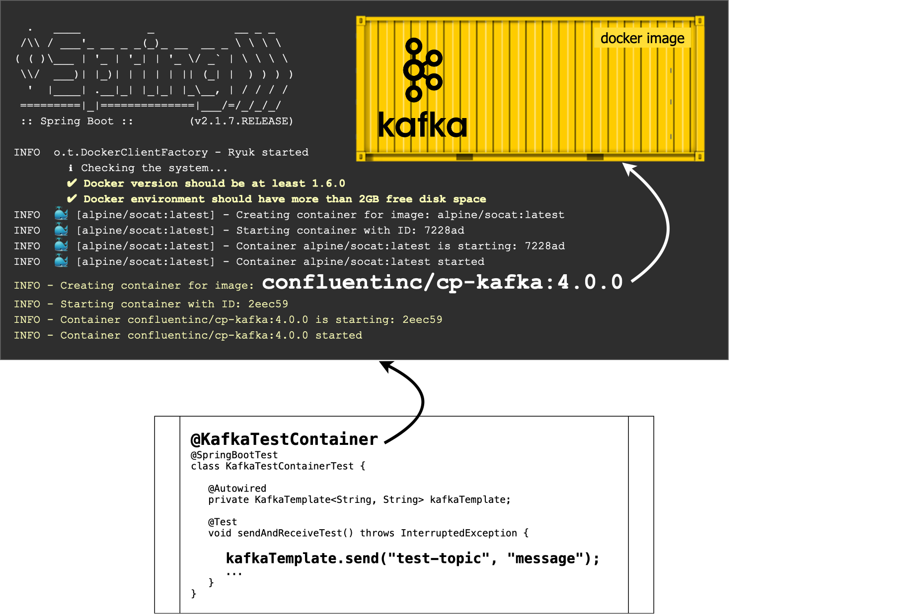

:toc: preamble

# Spring Test Kafka

image:https://travis-ci.com/jupiter-tools/spring-test-kafka.svg?branch=master["Build Status", link="https://travis-ci.com/jupiter-tools/spring-test-kafka"]
image:https://codecov.io/gh/jupiter-tools/spring-test-kafka/branch/master/graph/badge.svg["", link="https://codecov.io/gh/jupiter-tools/spring-test-kafka"]

Tools to write integration tests of Spring Framework with Redis.

## Overview

## How to write integration tests on Spring Boot with Apache Kafka

Add this library in dependencies:

[source,xml]
----
<dependency>
    <groupId>com.jupiter-tools</groupId>
    <artifactId>spring-test-kafka</artifactId>
    <version>0.1</version>
</dependency>
----

Now, you can start Kafka in docker (TestContainers) by the using of `@KafkaTestContainer` annotation in tests:

[source, java]
----
@SpringBootTest
@KafkaTestContainer
class RedisTestContainerTest {

    @Autowired
    private KafkaTemplate<String, String> kafkaTemplate;

    @Test
    void sendAndReceiveTest() throws InterruptedException {
        assertThat(kafkaTemplate).isNotNull();
        kafkaTemplate.send("test-topic", "flight of a dragon");
        ...
    }
}
----

You can use this annotation to start Kafka container in tests both with JUnit5 and JUnit4.
The implementation doesn't depend on some test framework, just on the Spring Framework.

## How to use multiple Kafka containers in the one test case:

[source, java]
----
@SpringBootTest
@KafkaTestContainer  <1>
@KafkaTestContainer(bootstrapServersPropertyName = "second.kafka.server") <2>
class MultipleContainerInOneTest {

    ...

}
----
<1> start a first Kafka test container and set a bootstrap servers of started container to default Spring Boot properties (`spring.kafka.bootstrap-servers`)
<2> start one more Kafka container and set a bootstrap servers to specified property, exactly in this property you can read an actual value of bootstrap servers after run the application context.
